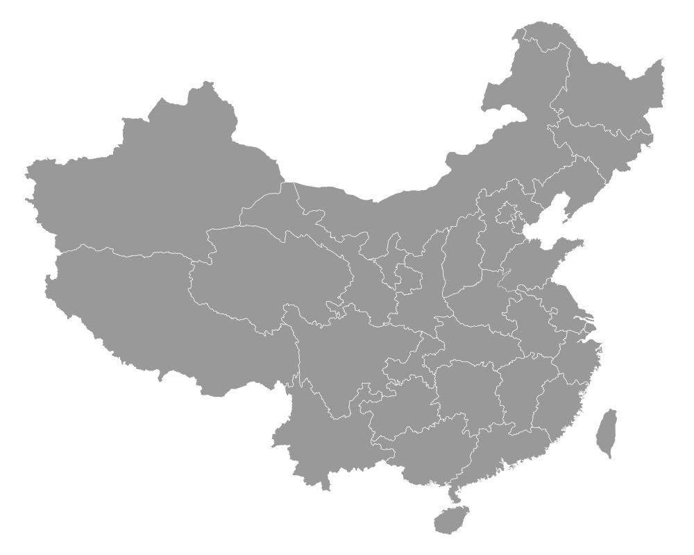
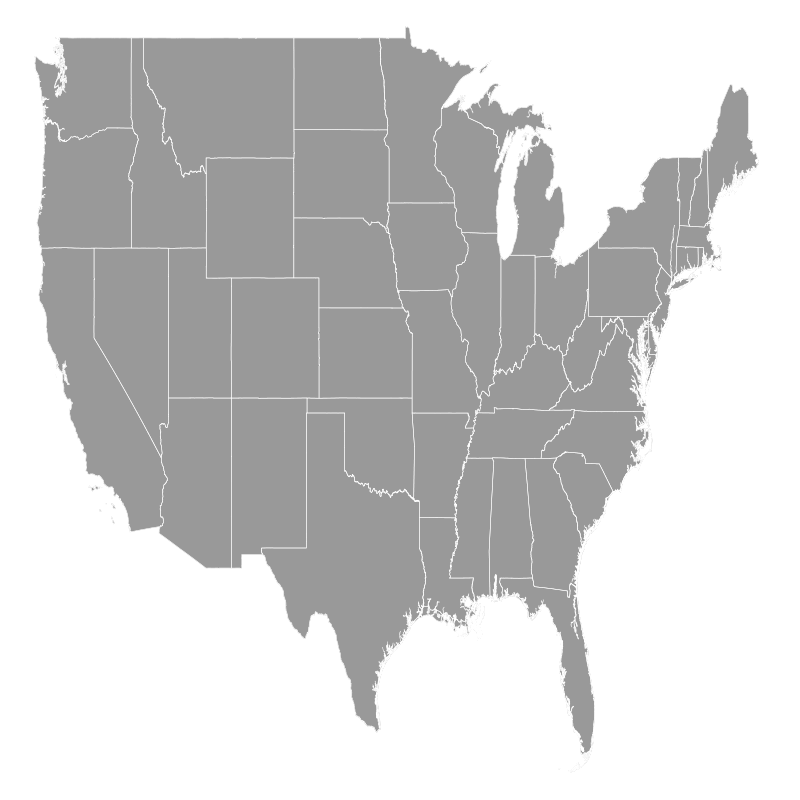
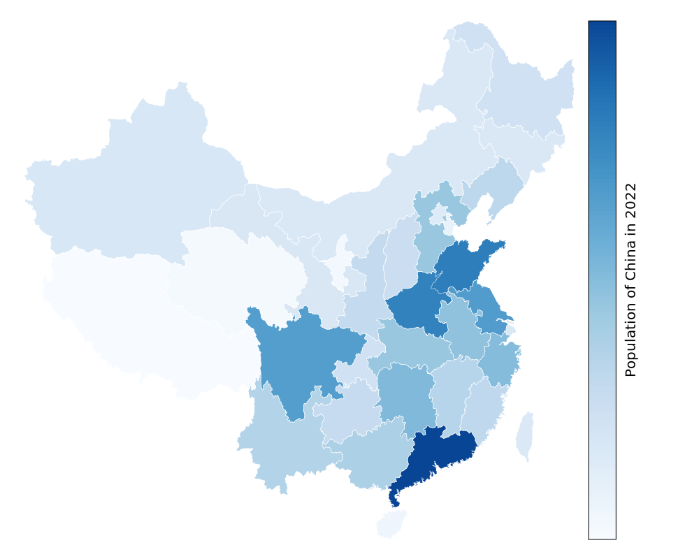

# A gunplot-friendly tool for GeoMap
This project is inspired by the script [shape2txt](http://www.gnuplotting.org/code/shape2txt), and it is aimed to create simply txt file from shapes files for the ease of use in gnuplot.

Users can also download your interested results in `data` folder directly if they are available.

## Motivation
Unlike other plotting alternatives (e.g., `ggplot2`), gnuplot does not provide built-in tools for GeoMap. Therefore, we need to prepare a *polygon* files manually.

Similar to [U.S. states and election results](http://www.gnuplotting.org/us-states-and-election-results/), a user-friendly data format can be:

```
#region name 1
<polygon 1>
<empty line>
<polygon 2>
<empty line>
...
<polygon N>
<empty line>
<empty line>
#region name 2
...
```
Each region may be constituted by several polygons, and polygons in one region are separated by an empty line. Note that regions are separated by two empty lines, so each region is considered as one data set in gnuplot. Please see the example of [Map of China](data/china.txt).

## Usage

First, you need to install [gdal](https://www.gdal.org/), and we are going to use its [ogr2ogr](https://gdal.org/programs/ogr2ogr.html) program.

> Note: The `conda` way failed in my computer, so I installed it by `homebrew` in MacOS, and by `pacman` in Manjaro.

### Convert Shapes to CSV

```bash
ogr2ogr -f CSV <output.csv> <input.shp> -lco GEOMETRY=AS_WKT
```

You can also use this utility script `shape2csv.sh`:

```bash
./shape2csv.sh -o output -i input
```

### Convert CSV to Txt

The Python script `convert.py` relies on `pandas`.

```bash
python3 convert.py [-h] [-o OUT] [-r REGION] -n NAME [-e] [-f FILTER [FILTER ...]] [-l LAST [LAST ...]] csv
```

Here `csv` is a positional argument, indicting the input csv file generated by ogr2ogr. Note that `-n NAME` is required, indicting the regions' name filed. For example, as for *shapes/china/china.shp*, it is `PINYIN_NAM`.

Optional arguments:

- `-o OUT, --out OUT`: *output txt file*; default is `out.txt`.
- `-r REGION, --region REGION`: *filed name for region polygons*; default is `WKT`.
- `-n NAME, --name NAME`: *filed name for region names* (**required**).
- `-e, --echo`: *print regions names*. If provided, it will print all regions names in the console.
- `-f FILTER [FILTER ...], --filter FILTER [FILTER ...]`: *filter regions names*.
- ` -l LAST [LAST ...], --last LAST [LAST ...]`: *last regions names*.

The following is an example:

```bash
python3 convert.py china.csv --name=PINYIN_NAM
```

To understand those parameters, I also prepared a tutorial on [how to generate the USA map](shapes).

## Example

> The visualizations may not be strictly matched with the real maps, so users should pay attention to the legal issues if the figures are publicly published.

### China Map 1
The complete code can be found at `gnuplot/china1.pg`.



### USA Map



### China Map 2

The complete code can be found at `gnuplot/china2.pg`.



### Taiwan Map

The complete code can be found at `gnuplot/taiwan.pg`, and the original shape file is downloaded from [MIT GeoWeb](https://geodata.mit.edu/catalog/stanford-fn648mm8787).


### Projects using this repository
- [Color scales](https://chenzhongpu.github.io/gnuplot/fundamental/color.html)